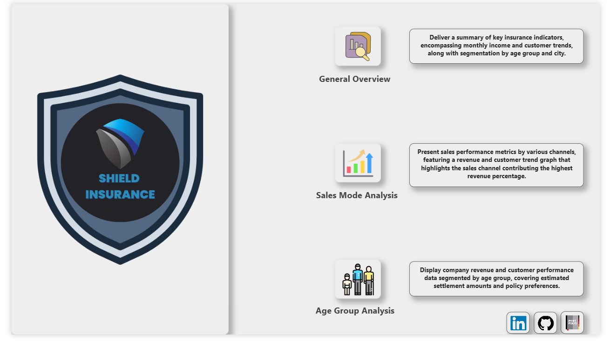
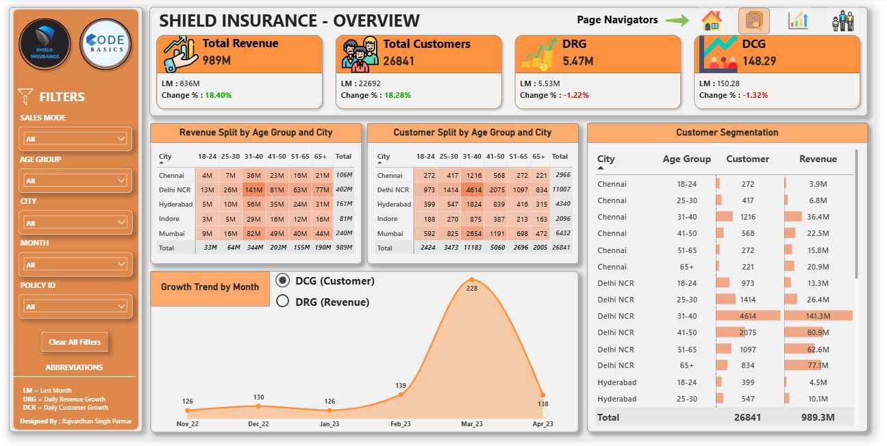
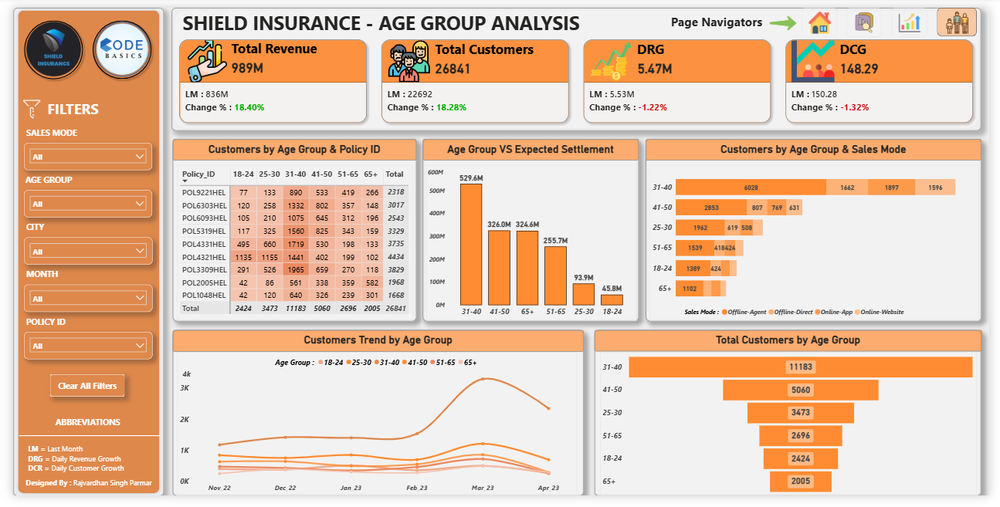
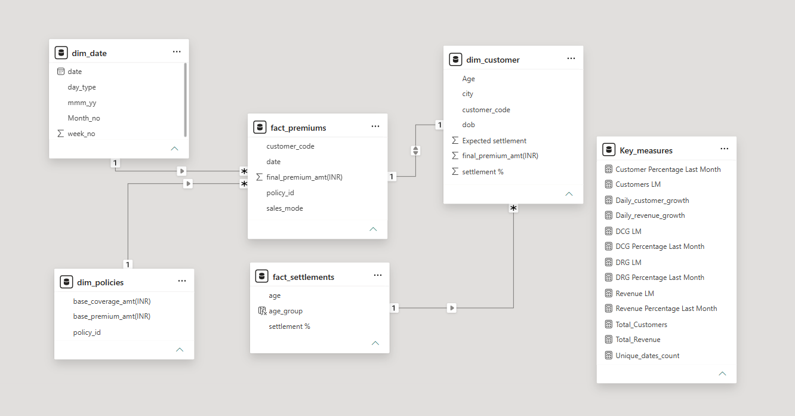

# 🛡️ Shield Insurance Analytics


> An interactive Power BI analytics solution built to analyze customer growth, revenue performance, sales-mode contribution, policy adoption, and customer segmentation for Shield Insurance.

---

## 🔍 Project at a Glance

|   🏥 Domain  | 🏢 Industry | 📊 Customer Records | 📁 Source Files | 🏙️ Cities |
| :----------: | :---------: | :--------: | :-------------: | :--------: |
| *Healthcare* | *Insurance* |  *26,841*  |     *5 CSVs*    |     *5*    |

| 💰 Revenue |   📅 Analysis Period  |  🧹 Data Preparation  | 💻 Primary Tool |
| :--------: | :-------------------: | :-------------------: | :-------------: |
|   *₹989M*  | *Nov 2022 – Apr 2023* | *Excel + Power Query* |    *Power BI*   |

---

## 🔗 Live Dashboard

👉 **[View the Interactive Power BI Dashboard](https://app.powerbi.com/view?r=eyJrIjoiMmUyZTkwNjgtY2Q4Ni00NDcyLTk0ODAtMzI2OTJkNGE0NjliIiwidCI6ImM2ZTU0OWIzLTVmNDUtNDAzMi1hYWU5LWQ0MjQ0ZGM1YjJjNCJ9&pageName=f4d32b6fbb3b100788bc)**


---

## 📌 Project Overview

Shield Insurance required a consolidated view of its customer and revenue performance to better understand where growth was coming from and which customer segments, sales modes, cities, and policies were contributing most to the business.

This project transforms five insurance-related CSV datasets into an interactive Power BI dashboard covering **26,841 records** across five cities from **November 2022 to April 2023**.

The dashboard provides a centralized view of:

- Customer acquisition and growth
- Revenue generation
- Daily customer and revenue growth
- Monthly performance trends
- Sales-mode contribution
- City-level performance
- Age-group segmentation
- Policy adoption
- Expected settlement analysis

The objective was to move from raw transactional data to a business-focused analytical solution that makes important trends easier to identify and investigate.

---

## 🎯 Business Problem & Objectives

Shield Insurance wanted to understand its customer and revenue performance and monitor how these metrics changed over time.

The analysis was designed to answer key business questions:

- How many customers does Shield Insurance have?
- How much revenue is being generated?
- How are daily customer and revenue growth changing?
- How does current performance compare with the previous month?
- Which sales modes contribute the most customers and revenue?
- Which cities generate the highest revenue and customer volume?
- Which age groups contribute the most customers and revenue?
- Which policies have the highest customer adoption?
- How are customer and revenue trends changing month over month?

### Objectives

The project focuses on:

1. Tracking **total customers and total revenue**.
2. Monitoring **daily customer growth and daily revenue growth**.
3. Comparing current performance with the **previous month**.
4. Analyzing monthly customer and revenue trends.
5. Evaluating sales-mode performance.
6. Segmenting customers by age group.
7. Comparing city-level customer and revenue performance.
8. Analyzing policy-level customer adoption.
9. Providing interactive filters for detailed analysis.
10. Enabling users to switch between customer and revenue trend views.

---

# 📊 Dashboard Walkthrough

The Power BI report consists of multiple pages, with each page designed to answer a different business question.

---

## 🏠 Home Page

The Home page acts as the navigation hub for the Power BI report.

It provides access to the main analytical sections:

- General Overview
- Sales Mode Analysis
- Age Group Analysis



---

## 📈 Overview

The Overview page provides the main business snapshot of Shield Insurance.

### Key areas covered:

- Total Revenue
- Total Customers
- Daily Revenue Growth
- Daily Customer Growth
- Revenue by Age Group and City
- Customers by Age Group and City
- Monthly Growth Trend
- Customer segmentation

The page also includes a switch between **DCG (Customer)** and **DRG (Revenue)** to analyze the monthly growth trend from different perspectives.



---

## 📊 Sales Mode Analysis

The Sales Mode Analysis page evaluates customer and revenue contribution across different sales channels.

### Sales modes analyzed:

- Offline-Agent
- Offline-Direct
- Online-App
- Online-Website

The page provides:

- Customer contribution by sales mode
- Revenue contribution by sales mode
- Monthly sales-mode trends
- Customer/Revenue switch
- Sales-mode filtering

This allows users to understand which channels are contributing most to customer acquisition and revenue generation.


---

## 👥 Age Group Analysis

The Age Group Analysis page focuses on customer segmentation and policy-level analysis.

It includes:

- Customers by Age Group & Policy ID
- Age Group vs Expected Settlement
- Customers by Age Group & Sales Mode
- Customer Trend by Age Group
- Total Customers by Age Group

This page helps identify which customer segments have the highest customer volume and how those segments interact with policies and sales modes.



---

## 📐 Data Model

The underlying Power BI model connects customer, date, policy, premium, and settlement information.

The model consists of:

- **3 Dimension Tables**
- **2 Fact Tables**
- **1 Key Measures Table**

The model supports analysis across customers, policies, dates, revenue, settlements, cities, age groups, and sales modes.



---

# 🔍 Key KPIs

The dashboard tracks four primary performance indicators and compares them with the previous month.

| KPI | Current | Previous Month | Change |
|---|---:|---:|---:|
| **Total Revenue** | ₹989M | ₹836M | **+18.40%** |
| **Total Customers** | 26,841 | 22,692 | **+18.28%** |
| **Daily Revenue Growth** | ₹5.47M | ₹5.53M | **-1.22%** |
| **Daily Customer Growth** | 148.29 | 150.28 | **-1.32%** |

### KPI Definitions

| KPI | Description |
|---|---|
| **Total Revenue** | Total revenue generated during the analyzed period |
| **Total Customers** | Total customers represented in the analysis |
| **Daily Revenue Growth** | Daily revenue growth metric used to monitor revenue performance |
| **Daily Customer Growth** | Daily customer growth metric used to monitor customer acquisition |
| **Previous Month Comparison** | Compares current KPI performance against the previous month |

---

# 💡 Key Insights

## 📈 1. March 2023 recorded the strongest customer acquisition

March 2023 reached approximately **7.1K customers**, representing the highest point in the displayed customer trend.

Customer acquisition then decreased to approximately **4.1K in April 2023**.

### Business implication

March should be investigated further to understand which **cities, sales modes, age groups, and policies** contributed to the increase.

---

## 🏙️ 2. Delhi NCR was the strongest-performing city

Delhi NCR generated approximately **₹402M in revenue** and had approximately **11,007 customers**.

### Business implication

Delhi NCR was the strongest-performing market in the analyzed data and represents an important area for understanding customer acquisition and revenue drivers.

---

## 🕵️ 3. Offline-Agent was the leading sales mode

Offline-Agent contributed approximately:

- **14.87K customers**
- **55.4% of total customers**
- **₹551M revenue**
- **55.7% of total revenue**

### Business implication

Offline-Agent was the largest contributor to both customer acquisition and revenue generation during the analyzed period.

---

## 👥 4. The 31–40 age group was the largest customer segment

The **31–40 age group** accounted for **11,183 customers**, making it the largest customer segment.

The next-largest segment was 41–50 with **5,060 customers**.

### Business implication

The 31–40 segment represents the most significant customer group and is important when analyzing customer behavior and policy adoption.

---

## 💰 5. The 31–40 age group generated the highest revenue

Revenue contribution by age group:

| Age Group | Revenue |
|---|---:|
| **31–40** | **₹344M** |
| 41–50 | ₹203M |
| 65+ | ₹190M |
| 51–65 | ₹155M |
| 25–30 | ₹64M |
| 18–24 | ₹33M |

### Business implication

The 31–40 segment is significant from both a **customer volume and revenue contribution** perspective.

---

## 🌟 6. POL4321HEL had the highest customer volume

`POL4321HEL` recorded **4,434 customers**, making it the highest-volume policy shown in the analysis.

### Business implication

The policy's strong customer adoption makes it a useful candidate for further analysis across age groups, sales modes, and revenue contribution.

---

## 📊 7. Offline-Agent contributed more than half of total revenue

Offline-Agent generated approximately **55.7% of total revenue**, closely aligned with its **55.4% share of customers**.

### Business implication

The sales mode is currently the largest contributor to both customer acquisition and revenue generation.

---

# 💼 Business Recommendations

## 1. Investigate the drivers behind the March 2023 growth spike

March reached approximately **7.1K customers**, making it the strongest month in the displayed customer trend.

The business can break down this increase by **city, sales mode, age group, and policy** to identify the specific drivers behind the spike.

---

## 2. Continue monitoring the Offline-Agent channel

Offline-Agent contributes approximately **55.4% of customers and 55.7% of revenue**.

The business can study the factors behind this channel's performance and evaluate whether successful practices can be applied to other sales modes.

---

## 3. Focus deeper analysis on the 31–40 customer segment

The 31–40 age group contains **11,183 customers** and contributes approximately **₹344M in revenue**.

Further analysis of this segment's policy preferences and sales-mode behavior can provide a better understanding of this important customer group.

---

## 4. Analyze the Delhi NCR market in greater detail

Delhi NCR contributes approximately **₹402M in revenue** and more than **11K customers**.

A deeper analysis of its age groups, sales modes, and policies can help identify the factors behind its stronger performance.

---

## 5. Investigate the success of POL4321HEL

With **4,434 customers**, POL4321HEL has the highest customer volume among the policies shown.

Further analysis can examine its customer demographics, sales modes, and revenue contribution to understand the factors behind its adoption.

---

# 🔄 Project Workflow

The project followed an end-to-end analytics workflow:

```text
                 Raw CSV Files
                       │
                       ▼
              Data Import & Review
                       │
                       ▼
            Data Cleaning & Validation
                       │
             ┌─────────┼─────────┐
             ▼         ▼         ▼
        Duplicates   Missing   Invalid
         & Errors     Values   Records
             │         │         │
             └─────────┼─────────┘
                       ▼
             Data Transformation
                       │
                       ▼
                 Data Modeling
                       │
                       ▼
               DAX & Measures
                       │
                       ▼
                 KPI Development
                       │
                       ▼
             Dashboard Development
                       │
                       ▼
                Business Analysis
                       │
                       ▼
              Insights & Recommendations
```

---

### Workflow Summary

| Stage | What was done |
|---|---|
| **Data Import** | Imported five CSV datasets into Power BI |
| **Data Cleaning** | Removed duplicates, handled missing values, removed invalid records, and corrected inconsistent values |
| **Data Preparation** | Standardized data types and validated important fields |
| **Transformation** | Prepared dates, age groups, sales modes, cities, policies, premium, and settlement data for analysis |
| **Data Modeling** | Connected dimension and fact tables to support cross-analysis |
| **DAX** | Created reusable measures for KPIs, growth, and previous-month comparisons |
| **Dashboard Development** | Built interactive analytical pages |
| **Analysis** | Evaluated customers, revenue, sales modes, cities, age groups, and policies |
| **Insights** | Identified key performance patterns |
| **Recommendations** | Connected findings to practical areas for further business investigation |

---

# 📂 Dataset & Data Sources

The project uses **five CSV files**, organized into dimension and fact tables.

| Dataset | Type | Purpose |
|---|---|---|
| `Dim_customer` | Dimension | Customer information and segmentation |
| `Dim_date` | Dimension | Date and time-based analysis |
| `Dim_policies` | Dimension | Policy details |
| `Fact_premiums` | Fact | Premium and revenue transaction information |
| `Fact_settlements` | Fact | Settlement-related information |

### Data Coverage

| Attribute | Coverage |
|---|---|
| **Records** | 26,841 |
| **Cities** | 5 |
| **Locations** | Chennai, Delhi NCR, Hyderabad, Indore, Mumbai |
| **Period** | November 2022 – April 2023 |
| **Source Format** | CSV |

---

# 🧹 Data Cleaning & Preparation

The raw insurance datasets were cleaned and prepared before building the Power BI analytical model.

### Data Cleaning

The preparation process included:

- Removed duplicate records.
- Handled missing and null values.
- Removed invalid records.
- Corrected inconsistent values.
- Standardized data types.
- Reviewed categorical fields for consistency.
- Cleaned fields used for filtering and segmentation.
- Validated key identifiers such as **Customer Code** and **Policy ID**.
- Reviewed numerical fields used for revenue, premium, and settlement calculations.
- Prepared date fields for daily and monthly analysis.

### Why Data Cleaning Was Important

The dashboard relies on accurate aggregation across customers, policies, dates, cities, age groups, sales modes, premiums, and settlements.

Cleaning and validation helped ensure that the data used for KPI calculations and visual analysis was consistent and suitable for business reporting.

---

# 🔄 Data Transformation

After cleaning, the data was transformed to support the business requirements.

### Key Transformations

- Prepared **Month-Year** fields for monthly trend analysis.
- Organized customers into age groups:
  - **18–24**
  - **25–30**
  - **31–40**
  - **41–50**
  - **51–65**
  - **65+**
- Prepared city-level analysis across five locations.
- Categorized transactions by sales mode:
  - **Offline-Agent**
  - **Offline-Direct**
  - **Online-App**
  - **Online-Website**
- Prepared policy-level information for customer analysis.
- Prepared premium and settlement fields for aggregation.
- Structured fields required for revenue and customer calculations.
- Prepared the model for interactive filtering by:
  - **Sales Mode**
  - **Age Group**
  - **City**
  - **Month**
  - **Policy ID**

These transformations made the datasets suitable for the dashboard's customer, revenue, policy, sales-mode, age-group, and time-based analysis.

---

# 📐 Data Model & Relationships

The Power BI model uses a structured combination of dimension and fact tables.

### Dimension Tables

| Table | Role |
|---|---|
| `Dim_customer` | Customer-level information |
| `Dim_date` | Date and time analysis |
| `Dim_policies` | Policy information |

### Fact Tables

| Table | Role |
|---|---|
| `Fact_premiums` | Premium and revenue transactions |
| `Fact_settlements` | Settlement-related information |

### Measures Table

A dedicated **Key Measures** table stores the DAX measures used throughout the dashboard.

The model allows the report to analyze business performance across:

**Customer → Date → Policy → Premium → Settlement → City → Age Group → Sales Mode**

This structure supports interactive filtering and cross-analysis throughout the dashboard.

---

# 🧮 DAX & Measures

DAX was used to create reusable business measures for KPI cards, growth analysis, previous-month comparisons, and dynamic dashboard calculations.

## Core KPI Measures

| Measure | Purpose |
|---|---|
| `Total_Revenue` | Calculates total revenue |
| `Total_Customers` | Calculates total customer count |

---

## Growth Measures

| Measure | Purpose |
|---|---|
| `Daily_revenue_growth` | Measures daily revenue growth |
| `Daily_customer_growth` | Measures daily customer growth |

---

## Previous-Month Measures

| Measure | Purpose |
|---|---|
| `Revenue LM` | Provides previous-month revenue |
| `Customers LM` | Provides previous-month customer count |
| `DRG LM` | Provides previous-month daily revenue growth |
| `DCG LM` | Provides previous-month daily customer growth |

---

## Percentage Comparison Measures

| Measure | Purpose |
|---|---|
| `Revenue Percentage Last Month` | Measures revenue change against the previous month |
| `Customer Percentage Last Month` | Measures customer change against the previous month |
| `DRG Percentage Last Month` | Measures change in daily revenue growth against the previous month |
| `DCG Percentage Last Month` | Measures change in daily customer growth against the previous month |

---

## Supporting Measure

| Measure | Purpose |
|---|---|
| `Unique_dates_count` | Supports date-based calculations |

### Role of DAX in the Project

The DAX measures allow the dashboard to dynamically calculate and display:

- Current KPIs
- Previous-month values
- Growth metrics
- Percentage changes
- Filter-responsive results

This enables users to interact with the report and analyze different customer, city, sales-mode, age-group, month, and policy segments.

---

# 🎛️ Dashboard Features

The dashboard was designed to allow users to explore the data interactively.

### Filters & Slicers

Users can filter the analysis by:

- **Sales Mode**
- **Age Group**
- **City**
- **Month**
- **Policy ID**

### Interactive Features

- KPI cards
- Current vs previous-month comparisons
- Percentage change indicators
- Customer and revenue trend analysis
- Customer/Revenue switch
- DCG/DRG switch
- Sales-mode analysis
- Age-group analysis
- City-level analysis
- Policy-level analysis
- Interactive tables
- Page navigation
- Clear All Filters functionality

---

# 🏆 Project Outcome

The Shield Insurance Analytics project transformed five insurance-related CSV datasets into an interactive Power BI reporting solution.

The dashboard provides a consolidated view of:

**Customers → Revenue → Growth → Sales Modes → Cities → Age Groups → Policies**

The analysis identified several important business patterns:

- **₹989M** total revenue
- **26,841** total customers
- **Delhi NCR** as the leading city by revenue and customer count
- **Offline-Agent** as the leading sales mode
- **31–40** as the largest customer and revenue-contributing age group
- **March 2023** as the strongest customer acquisition month
- **POL4321HEL** as the highest-volume policy

The project demonstrates the ability to move from **raw business data to a structured analytical model, interactive dashboard, business insights, and data-driven recommendations**.

---

# 🛠️ Tools & Technologies

| Technology | Used For |
|---|---|
| **Power BI** | Dashboard development, visualization, and interactive analysis |
| **Power Query** | Data cleaning and transformation |
| **DAX** | KPI, growth, and comparison calculations |
| **CSV** | Source datasets |

---

# 👨‍💻 Skills Demonstrated

| Skill Area | Skills |
|---|---|
| **Data Preparation** | Data Cleaning, Data Validation, Missing Value Handling, Duplicate Removal, Data Type Standardization |
| **Data Transformation** | Data Transformation, Categorization, Date Preparation, Customer Segmentation |
| **Data Modeling** | Fact & Dimension Tables, Relationships, Analytical Data Model |
| **Data Analysis** | Customer Analysis, Revenue Analysis, Growth Analysis, Trend Analysis, Policy Analysis |
| **Power BI** | Power Query, DAX, KPI Development, Interactive Dashboard Development |
| **Visualization** | KPI Cards, Trend Analysis, Tables, Segmentation, Interactive Filters |
| **Business Analysis** | Business Problem Solving, Insight Generation, Recommendations |
| **Data Storytelling** | Turning analytical findings into clear business-focused insights |

---

## ⭐ Key Takeaway

**This project demonstrates an end-to-end approach to turning raw insurance data into actionable business insights using Power BI. The analysis identified the key contributors to customer and revenue growth across cities, sales modes, age groups, and policies, while showcasing practical skills in data preparation, transformation, modeling, DAX, visualization, and business storytelling.**
